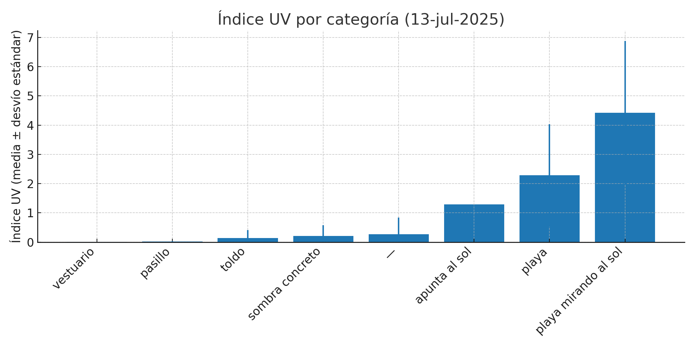

# Medición de radiación UV - 13 de julio de 2025

Este repositorio documenta un experimento de medición de radiación UV realizado con un **Arduino MKR WiFi 1010** y el **MKR ENV Shield**.

## 🎯 Objetivo
**Verificar si debajo del toldo blanco es un lugar seguro para estar sin protección solar.**

## 🛠️ Hardware
- Placa: Arduino MKR WiFi 1010  
- Shield: Arduino MKR ENV  
- Librería: `Arduino_MKRENV`

## 📂 Archivos
- `medicion_uv_13jul.ino`: Sketch usado en el experimento.  
- `lecturas_uv_13jul_limpio.csv`: Lecturas obtenidas (UVA, UVB, Índice UV y etiqueta).  
- `tabla_resumen_categorias.csv`: Estadísticas por categoría (media, desvío estándar, número de lecturas).  
- `grafico_uv_categorias_sd_corr.png`: Visualización por categoría con barras de error.  

## 📍 Contexto
- **Fecha:** 13 de julio de 2025  
- **Hora:** ~15:30  
- **UV oficial (Meteocat):** 9 (muy alto)  

Se midió en:
- Vestuario (sombra profunda)  
- Pasillo  
- Bajo toldo blanco  
- Exterior abierto / playa mirando al sol  
- Sombra de concreto  

## 📊 Resultados consolidados

### Tabla resumen
(ver `tabla_resumen_categorias.csv`)

### Gráfico por categoría

### Interpretación
- Bajo el **toldo blanco** el índice UV aparece como negativo, lo que en realidad significa **≈0**: **lugar seguro en cuanto a radiación UV**.  
- En **sombra de concreto** y **pasillo** los valores también se mantuvieron cercanos a cero, confirmando una protección eficaz.  
- En la **playa / exterior mirando al sol** los valores fueron altos (hasta >7), como era esperable.  
- Las diferencias con el valor oficial reportado por Meteocat (UV=9) se deben a la posición local del sensor, orientación al sol y condiciones específicas de la medición.  

## ✅ Conclusión final
**Debajo del toldo blanco es seguro permanecer sin protección solar en cuanto a radiación UV.**  

---
